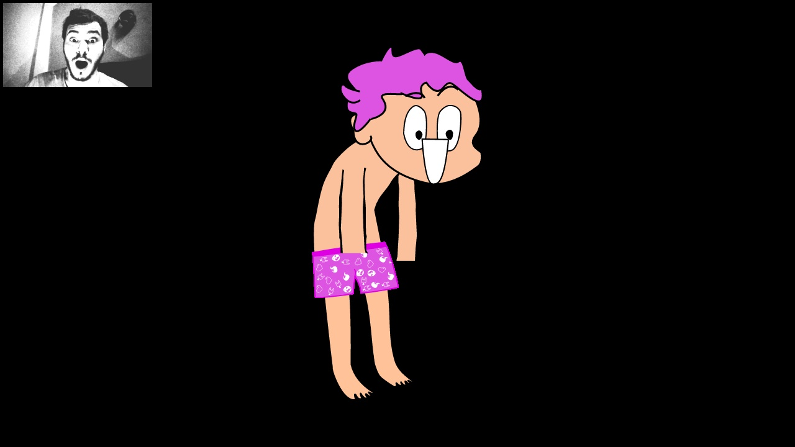

<h1 align="middle">[Rein]carnation</h1>

A experimental vtuber renderer/app using super-easy-to-make[^1] svg models.

[^1]: Rein's models are zero-config zero-rigging, toggles and keyframes can be
optionally added to improve models.

### Roadmap

This is a reincarnation of a dead project I started in 2022.\
The plan is to update and improve on it, create a friendly GUI, and make it
available for everyone.

<p align="middle">
    
    
</p>

#### How to use

Not yet ready for public use.

#### How to create a svg model

TODO

#### How to Dev

```sh
git clone https://github.com/ker0olos/rein && cd rein
python3 -m venv .venv && source .venv/bin/activate
pip install -e . && pip install -r requirements.txt
sh download_ml_models.sh
python3 preview_webcam.py
```
